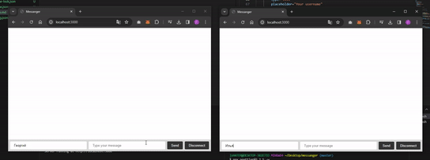

# Messenger

Простое веб-приложение для обмена сообщениями

## Технологии

1. Node.js
2. Express
3. Soket.io

## Запуск

1. Установка зависимостей

```bash
npm install
```

2. В корневой папке

```bash
ts-node index.ts
```

## Предпросмотр

